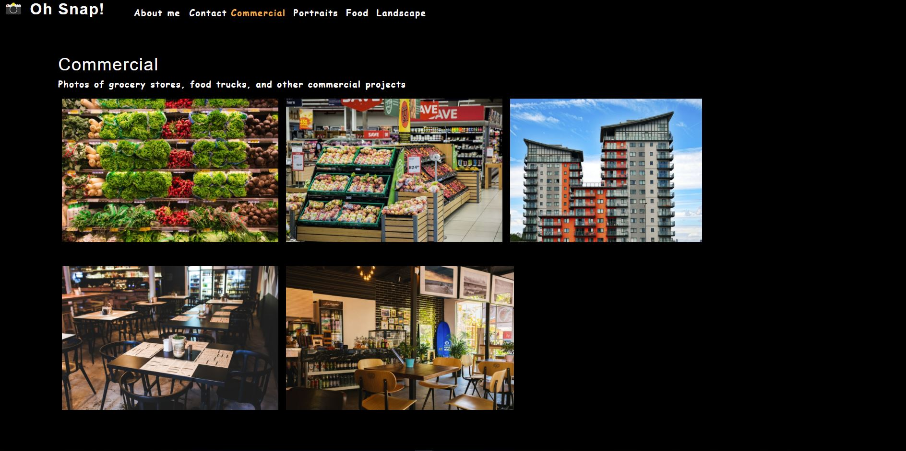

# Photo-Port
  

## Description
This is a mock portfolio for an aspiring photographer. Using the React Library a high quality, interactive, and structured portfolio was created. This project shows the use of state management, props and how a SPA could be built.

## Table of Contents
* [Installation](#installation)
* [Usage](#usage)
* [Questions](#questions)
* [Contributions](#contributions)
* [Test](#test)

## Installation
Clone the repo, download dependencies and run npm start.

## Usage
[Photo-Port production link](https://blitman12.github.io/photo-port/)

## Questions
Please visit my [GitHub profile](https://github.com/blitman12) for other cool projects
If you have any remaining questions please feel free to reach me at bradlitman94@gmail.com

## Contributions
Created with the help of the UofA BootCamp

## Test
Testing libraries used are Jest and Reacts testing library
